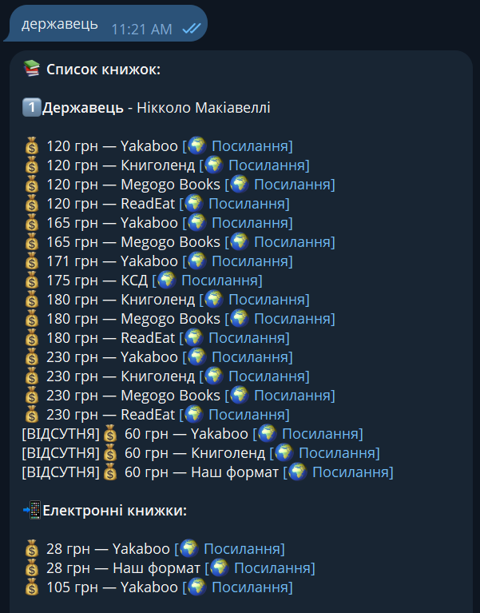
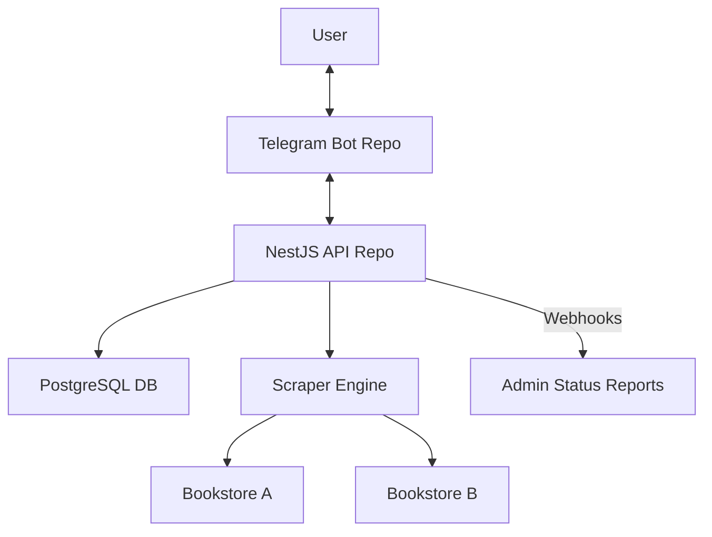

  
<h2> Project Name: Декниги </h2>

# 📚 DeKnyhy (ДеКниги) — Telegram Book Search Engine

**DeKnyhy** is a high-performance Telegram bot designed to aggregate, compare, and track book prices across all major Ukrainian bookstores. 

Originally launched as a student project, it went viral on Ukrainian Twitter, hitting 20x the expected traffic overnight. This led to a complete re-engineering of the 
project from a monolithic prototype into a scalable **NestJS API** with a custom search-scoring engine.

🎬[DEMO](https://t.me/deknigi_bot)

> [!TIP]
> This is the **Backend API** repository. The telegram bot's part is a private Aiogram-based Telegram bot

---

## 🚀 The Backstory: Scaling Under Pressure
After the initial launch, the bot's sudden popularity created a "good problem to have": the original architecture couldn't handle the concurrency. I performed a full system rewrite to **NestJS**, moving away from "push-to-main" deployments to a professional API architecture. This transition solved critical uptime issues and allowed for the implementation of complex search logic.

### 📈 Real-World Impact (To Date):
- **Users:** 10,000+ registered users.
- **Data:** Indexed 60,000+ unique book entries.
- **Traffic:** Successfully served 20,000+ search requests with high uptime.

---

## ✨ Features

- **🎯 Intent-Aware Search:** Implemented a custom query parser that detects author names within search strings. The engine isolates titles to reduce "noise" while applying a weighted score boost to results matching the identified author.
- **⚖️ Custom Relevance Scoring:** Developed a proprietary ranking algorithm that sorts results based on availability, price, and query proximity—mimicking the behavior of a specialized search engine.
- **📊 Real-time Data Aggregation:** A resilient pipeline that parses and normalizes data from 10+ major Ukrainian retailers (Yakaboo, Vivat, Є-книгарня, KSD, etc.) into a unified schema.
- **📉 Price History Infrastructure:** The PostgreSQL schema is pre-optimized for time-series data, ready to support upcoming "Price Drop" notifications and historical price trend visualization.
- **🛡️ Production Resilience:** Advanced error-handling to manage inconsistent upstream site structures and rate-limiting, ensuring the bot remains stable even when source websites change.
- **⚡ Performance Optimized:** Modular NestJS architecture ensures sub-second response times even during high-concurrency periods.

## 🏗 System Architecture

The API follows a modular architecture designed for high availability and data integrity.

## 📡 Webhooks & Reporting
The API isn't just a passive data store. It features an outbound Webhook Service that pushes daily/hourly usage statistics.

---

## 🛠 Tech Stack

- **Framework:** [NestJS](https://nestjs.com/) (Node.js)
- **Database:** [PostgreSQL](https://www.postgresql.org/) with [Prisma](https://www.prisma.io/)
- **Bot Engine:** [Aiogram](https://aiogram.dev/) (Telegram Bot API)
- **Architecture:** Modular API-first design
- **Language:** TypeScript

---

## 📈 Roadmap

- [x] Full NestJS rewrite for scalability.
- [x] Advanced search scoring & author detection logic.
- [ ] **Price Drop Alerts:** Real-time notifications when a tracked book hits a target price.
- [ ] **Market Analytics:** Visualizing price trends across the Ukrainian book market.

---

## 👨‍💻 Author

**Yehor** – Backend Developer
*Focused on building scalable, data-driven solutions.*

---
